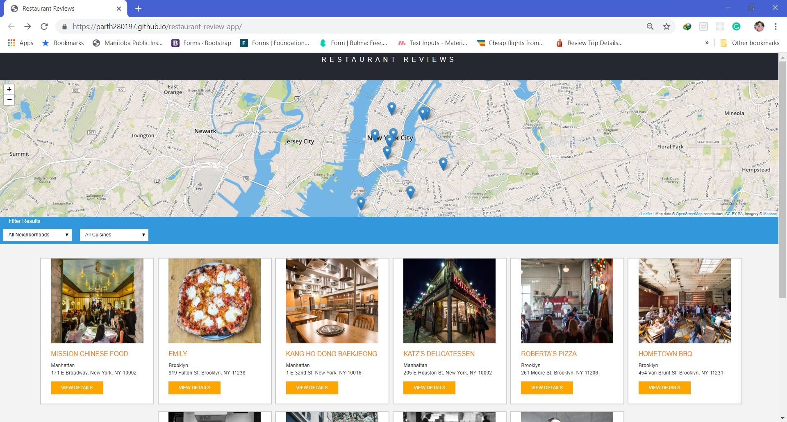
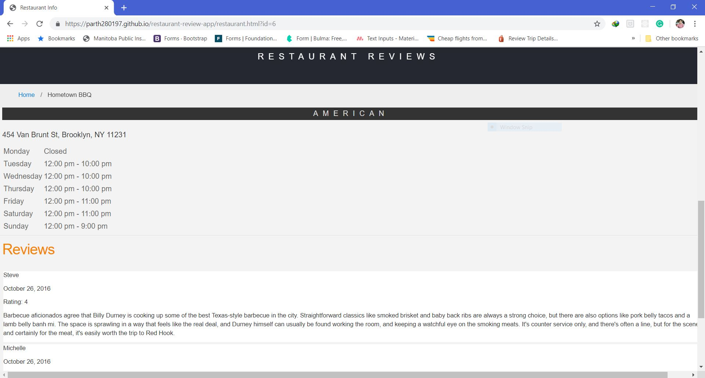

# Restaurant review app
---
## Technologies
   1.HTML
   2.CSS
   3.JS
   4.service worker
   5.Leaflet.js and Mapbox
   
## Specification:
   1.Progressive Work App.Works fine without Internet.
   2.Have responsive design, good look and feel on all type of devices.
   3.Most of code written using ES6 concepts.
   4.Shows all restaurant on main page having map at top where you can interect with map by click on location of restaurant to get more detail.
   5.Have a detail page which shows timming and reviews of individual restaurant.
   
## Implementation
 As part of school project,instructor provided code which has lots of bugs. Our goal was to make it smooth and working. I have solved various bugs like design was not responsive and proper, service worker not included, having issue with the map api and many more. 

## Screen Shots
1.home page

2.Detail page

